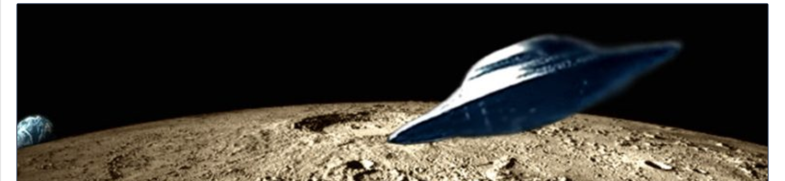
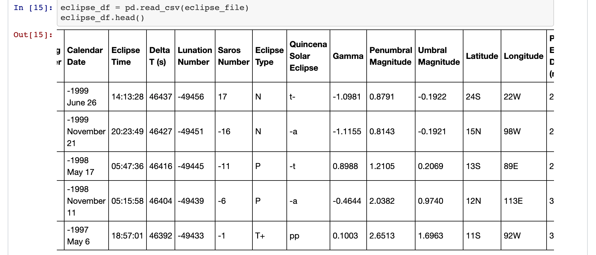
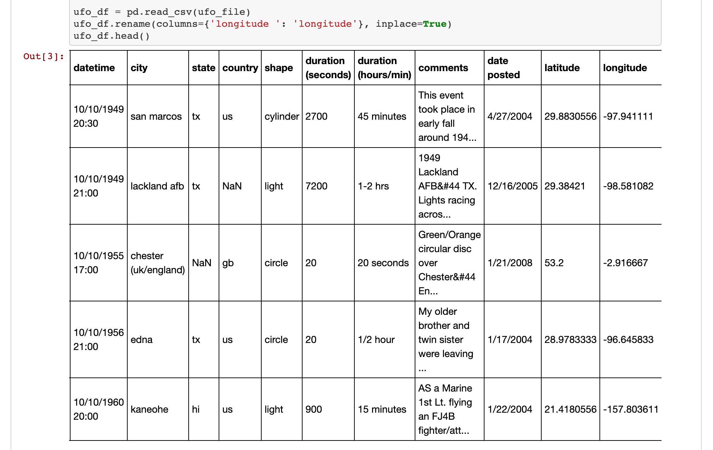

## Galactic ETL | Exploring UFO Sightings with Extract-Transform-Load 

### Project Description

A project utilizing ETL (extract, transform, load) database functions, exploring a fun and interesting data question: *Are there more UFO sightings during lunar eclipses?*

This project utilizes Jupyter notebook and Pandas dataframes to extract and transform data, loading to SQL database via SQLAlchemy connection engine.



#### Data Sources:

#### Two datasets from Kaggle, one on UFO Sightings and another on Lunar Eclipses
   * [UFO Sightings:](https://www.kaggle.com/NUFORC/ufo-sightings) Reports of unidentified flying object reports in the last century | National UFO Reporting Center (NUFORC)
   * [Solar and Lunar Eclipses:](https://www.kaggle.com/nasa/solar-eclipses/) Date, time, and location of every eclipse in five thousand years | NASA

#### Data Tools Used:

* Jupyter notebook with Pandas Dataframes
* SQL
* SQLAlchemy

Dependencies:
```
import pandas as pd
import numpy as np
import matplotlib.pyplot as plt
```

#### ETL Project Team:
Joe Grobelny | Brian R. Hackett | Shannon Wills

---

### Project Steps: Overview

#### 1. Extract:
Discovery process involved finding data sources that both had the data we wanted and that would combine together reasonably well. This turned out to be more difficult than expected, as we needed to find datasets that we could compare and contrast using comparable date and location data. We ended up finding such sets on Kaggle, and imported both datasets into Jupyter and display as dataframes.

#### 2. Transform:
* Rounded and converted latitude and longitude values in ufo dataframe to match the lunar dataframe
* Transformed datetime data in both tables to standardize and allow for joins and further transformations
* See images below for visual display of transformations
   
#### 3. Load: 
Create a database connection via SQLAlchemy and save dataframes to SQL database

### ETL Display:

*Original eclipse dataframe displays date and time in separate columns, with time in 6-figure military time, and latitude/longitude displayed with rounded values and directional markers (E/W):*



*Original ufo dataframe displays datetime in a combined column, and latitude/longitude with full numerical description:*



*Transformed dataframes display date and lat/lng in formats that now match one another: in both dataframes we now see dates separated from time and displayed in their own column in format 12/34/5678, and latitude/longitude rounded values/directional markers in format 12W:*


